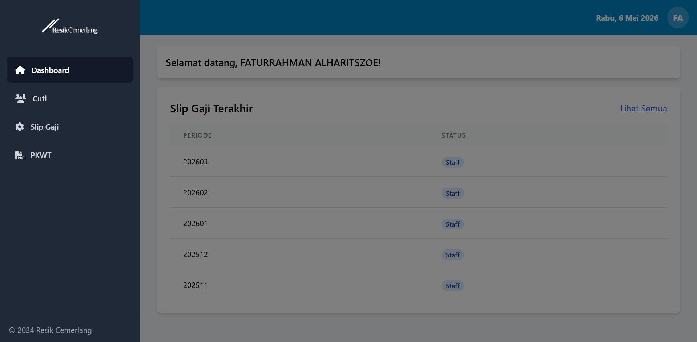
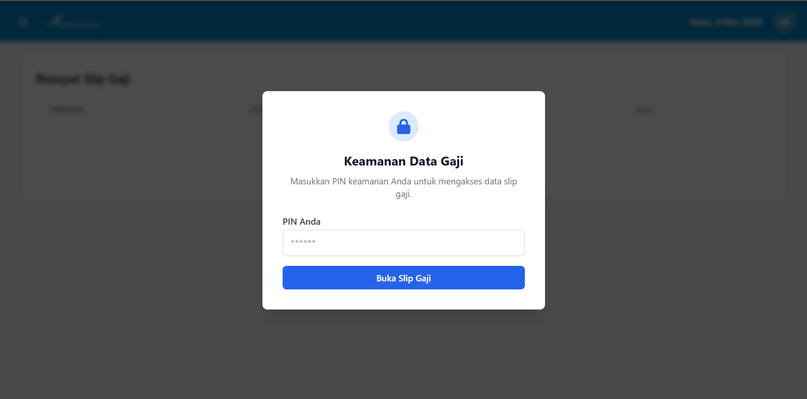
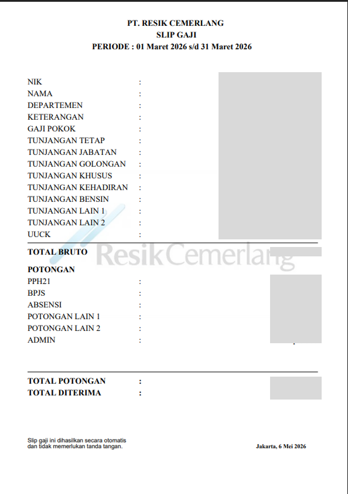

# Internal HRIS System (Resik Cemerlang)


A comprehensive Internal Human Resource Information System (HRIS) built to streamline employee management, payroll, and leave monitoring. This application features a robust multi-tenant architecture supporting multiple regions and tenants.

## 📸 Visual Preview

<p align="center">
  
  <br />
  <i>Main Dashboard: Employee statistics and regional overview.</i>
</p>

<p align="center">
  
  
  <br />
  <i>Left: PIN Security Verification. Right: Digital Salary Slip Management.</i>
</p>

---

## 🚀 Key Features

### 💰 Payroll Management (Slip Gaji)
- **Digital Payslips**: Generate and view monthly salary slips instantly.
- **Secure Access**: Protected by a 6-digit PIN system with Bcrypt encryption.
- **Bulk Upload**: Admin tools to process staff salary data via Excel (`.xlsx`).
- **Export to PDF**: Professional PDF generation using `jspdf` and `pdf-lib`.

### 📅 Leave & Attendance Monitoring (Cuti)
- **Real-time History**: Track all previous leave and attendance records.
- **Automated Quota**: Calculation based on employee tenure and project calendars.
- **Calendar Sync**: Integrated with national holidays and mandatory leave (Cuti Bersama).

### 🔐 Advanced Security
- **Multi-layer Hashing**: Passwords secured using a custom `SHA-256(MD5(password))` pattern.
- **Session Security**: PIN-based verification for all financial and sensitive data access.
- **RBAC**: Role-Based Access Control for Admins, Staff, and Field Employees.

### 🏢 Corporate Architecture
- **Multi-tenant Support**: Scalable design handling multiple companies and regions.
- **Efficient Pooling**: MySQL connection pooling for high-performance data retrieval.

---

## 🛠️ Technical Stack

- **Frontend**: React 19, Tailwind CSS (Custom Styling), Recharts (Analytics).
- **Backend**: Node.js, Express.js.
- **Database**: MySQL (optimized with `mysql2/promise`).
- **Security**: Bcrypt.js, Crypto (Node), PIN-based authentication.

## 💡 System Impact
- **Paperless Workflow**: 100% reduction in physical payslip printing and distribution.
- **Enhanced Privacy**: Strict data isolation between different tenants and regions.
- **Mobile Friendly**: Fully responsive design for field employees access.

## 🚦 Getting Started

### Prerequisites
- Node.js (v18 or higher)
- MySQL Server

### Installation

1. **Clone the repository**
   ```bash
   git clone https://github.com/faturrahmanalharitszoe/internal-HRIS-RC.git
   ```

2. **Backend Setup**
   ```bash
   cd backend
   npm install
   # Create .env based on index.js requirements
   npm start
   ```

3. **Frontend Setup**
   ```bash
   cd frontend/internal-app
   npm install
   npm start
   ```

---
*Developed for internal optimization at Resik Cemerlang.*

